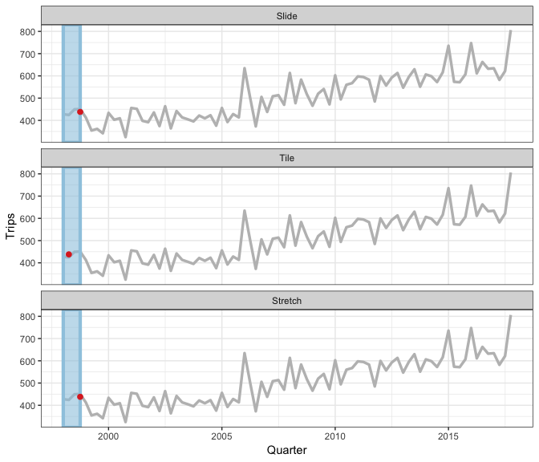

<!-- README.md is generated from README.Rmd. Please edit that file -->

# tsibble 

[](https://travis-ci.org/tidyverts/tsibble)
[](https://ci.appveyor.com/project/tidyverts/tsibble)
[](https://codecov.io/github/tidyverts/tsibble?branch=master)
[](https://cran.r-project.org/package=tsibble)
[](https://cran.r-project.org/package=tsibble)

```{r, echo = FALSE}
knitr::opts_chunk$set(
  collapse = TRUE, comment = "#>", fig.path = "man/figures/"
)
options(tibble.print_min = 5)
```

The **tsibble** package provides a data class of `tbl_ts` to represent tidy temporal data. A *tsibble* consists of a time index, key and other measured variables in a data-centric format, which is built on top of the *tibble*.

## Installation

You could install the stable version on CRAN:

```{r, eval = FALSE}
install.packages("tsibble")
```

You could install the development version from Github using

```{r, eval = FALSE}
# install.packages("remotes")
remotes::install_github("tidyverts/tsibble")
```

## Get started

### Coerce to a tsibble with `as_tsibble()`

The `weather` data included in the package `nycflights13` is used as an example to illustrate. The "index" variable is the `time_hour` containing the date-times, and the "key" is the `origin` as weather stations. **The key together with the index uniquely identifies each observation**, which gives a valid *tsibble*. Other columns can be considered as measured variables.

```{r nycflights13, message = FALSE}
library(tsibble)
library(dplyr)
weather <- nycflights13::weather %>% 
  select(origin, time_hour, temp, humid, precip)
weather_tsbl <- as_tsibble(weather, key = origin, index = time_hour)
weather_tsbl
```

The **key** is comprised of one or more variables. See `package?tsibble` and [`vignette("intro-tsibble")`](http://tsibble.tidyverts.org/articles/intro-tsibble.html) for details.

*Tsibble* internally computes the interval for given time indices based on the time representation, ranging from year to nanosecond, from numerics to ordered factors. The `POSIXct` corresponds to sub-daily series, `Date` to daily, `yearweek` to weekly, `yearmonth` to monthly, `yearquarter` to quarterly, and etc.

### `fill_gaps()` to turn implicit missing values into explicit missing values

Often there are implicit missing cases in time series. If the observations are made at regular time interval, we could turn these implicit missingness to be explicit simply using `fill_gaps()`, filling gaps in precipitation (`precip`) with 0 in the meanwhile. It is quite common to replaces `NA`s with its previous observation for each origin in time series analysis, which is easily done using `fill()` from *tidyr*.

```{r fill-na}
full_weather <- weather_tsbl %>%
  fill_gaps(precip = 0) %>% 
  group_by(origin) %>% 
  tidyr::fill(temp, humid, .direction = "down")
full_weather
```

`fill_gaps()` also handles filling in time gaps by values or functions, and respects time zones for date-times. Wanna a quick overview of implicit missing values? Check out [`vignette("implicit-na")`](http://tsibble.tidyverts.org/articles/implicit-na.html).

### `index_by()` + `summarise()` to aggregate over calendar periods

`index_by()` is the counterpart of `group_by()` in temporal context, but it groups the index only. In conjunction with `index_by()`, `summarise()` and its scoped variants aggregate interested variables over calendar periods. `index_by()` goes hand in hand with the index functions including `as.Date()`, `yearweek()`, `yearmonth()`, and `yearquarter()`, as well as other friends from *lubridate*. For example, it would be of interest in computing average temperature and total precipitation per month, by applying `yearmonth()` to the hourly time index.

```{r tsummarise}
full_weather %>%
  group_by(origin) %>%
  index_by(year_month = yearmonth(time_hour)) %>% # monthly aggregates
  summarise(
    avg_temp = mean(temp, na.rm = TRUE),
    ttl_precip = sum(precip, na.rm = TRUE)
  )
```

While collapsing rows (like `summarise()`), `group_by()` and `index_by()` will take care of updating the key and index respectively. This `index_by()` + `summarise()` combo can help with regularising a tsibble of irregular time space too.

### A family of window functions: `slide()`, `tile()`, `stretch()`

Time series often involves moving window calculations. Several functions in *tsibble* allow for different variations of moving windows using purrr-like syntax:

* `slide()`/`slide2()`/`pslide()`: sliding window with overlapping observations.
* `tile()`/`tile2()`/`ptile()`: tiling window without overlapping observations.
* `stretch()`/`stretch2()`/`pstretch()`: fixing an initial window and expanding to include more observations.

<details><summary>Rolling window animation</summary>

```{r animate, echo = FALSE, warning = FALSE, message = FALSE, eval = FALSE}
library(tidyverse)
library(gganimate)
reveal_group <- function(data, group){
  group <- enquo(group)
  data <- as_tibble(data)
  data <- transmute(
    data, !! group,
    .dt = map(map(!! group, seq_len), function(groups, data) {
      data <- filter(data, !! group %in% groups)
      select(data, !! expr(-!! group))
    }, data
  ))
  unnest(data, .dt)
}
tourism_melb <- tourism %>% 
  filter(Region == "Melbourne", Purpose == "Holiday")
types <- forcats::fct_inorder(c("Slide", "Tile", "Stretch"))
slide_window <- slider(tourism_melb$Quarter, .size = 4) %>%
  map_dfr(function(x) tibble(xmin = min(x), xmax = max(x))) %>%
  mutate(ymin = -Inf, ymax = Inf, group = row_number(), type = types[1])
slide_mean <- tourism_melb %>%
  mutate(ma = slide_dbl(Trips, ~ mean(.x), .size = 4, .align = "r")) %>%
  mutate(group = pmax(0, row_number() - 3), type = types[1])
slide_revealed <- slide_mean %>%
  reveal_group(group)

tile_window <- tiler(tourism_melb$Quarter, .size = 4) %>%
  map_dfr(function(x) tibble(xmin = min(x), xmax = max(x))) %>%
  mutate(ymin = -Inf, ymax = Inf, type = types[2])
tile_window <- tile_window[c(rep(1:20, each = 4)), ] %>% 
  mutate(group = row_number())
tile_mean <- tibble(
    Quarter = do.call("c", tile(tourism_melb$Quarter, ~ .x[2], .size = 4)),
    ma = tile_dbl(tourism_melb$Trips, ~ mean(.x), .size = 4),
    type = types[2]
  )
tile_mean <- tile_mean[c(rep(1:20, each = 4)), ] %>% 
  mutate(group = row_number())
tile_revealed <- tile_mean %>%
  reveal_group(group)

stretch_window <- stretcher(tourism_melb$Quarter, .init = 4) %>%
  map_dfr(function(x) tibble(xmin = min(x), xmax = max(x))) %>%
  mutate(ymin = -Inf, ymax = Inf, group = row_number(), type = types[3])
stretch_mean <- tourism_melb %>%
  mutate(
    ma = stretch_dbl(Trips, ~ mean(.x), .init = 4),
    group = pmax(0, row_number() - 3),
    type = types[3]
  )
stretch_revealed <- stretch_mean %>%
  reveal_group(group)

window <- bind_rows(slide_window, tile_window, stretch_window)
mean <- bind_rows(slide_mean, tile_mean, stretch_mean)
revealed <- bind_rows(slide_revealed, tile_revealed, stretch_revealed)

ggplot() +
  geom_line(aes(x = Quarter, y = Trips), data = tourism_melb, colour = "grey", size = 1.2) +
  geom_rect(aes(
    xmin = xmin, xmax = xmax,
    ymin = ymin, ymax = ymax,
    group = group
  ), data = window, 
  fill = "#9ecae1", colour = "#9ecae1", size = 1.5, alpha = 0.6) +
  geom_point(aes(x = Quarter, y = ma), data = mean, size = 2, colour = "#de2d26") +
  geom_line(aes(x = Quarter, y = ma), data = revealed, size = 1.2, colour = "#de2d26") +
  xlab("Quarter") +
  ylab("Trips") +
  facet_wrap(~ type, ncol = 1) +
  theme_bw() +
  transition_manual(group)
```



</details>

For example, a moving average of window size 3 is carried out on hourly temperatures for each group (*origin*).

```{r slide}
full_weather %>% 
  group_by(origin) %>% 
  mutate(temp_ma = slide_dbl(temp, ~ mean(., na.rm = TRUE), .size = 3))
```

Looking for rolling in parallel? Their multiprocessing equivalents are prefixed with `future_`. More examples can be found at [`vignette("window")`](https://tsibble.tidyverts.org/articles/window.html).

## More around tsibble

Tsibble also serves as a natural input for forecasting and many other downstream analytical tasks. Stay tuned for [tidyverts.org](https://tidyverts.org).

---
Please note that this project is released with a [Contributor Code of Conduct](.github/CODE_OF_CONDUCT.md).
By participating in this project you agree to abide by its terms.
